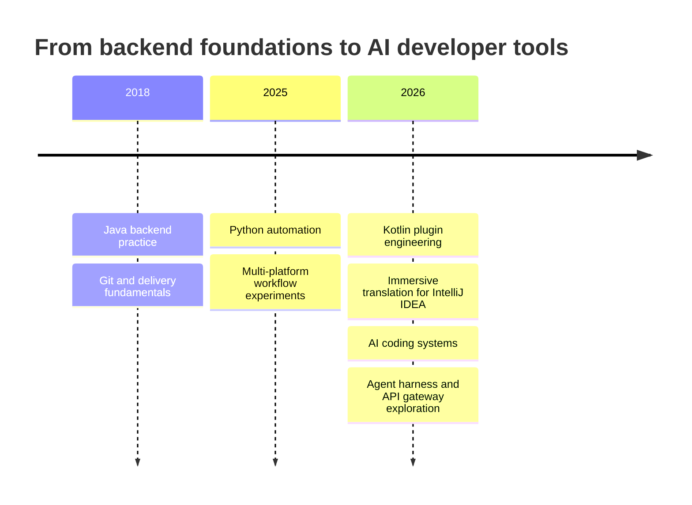
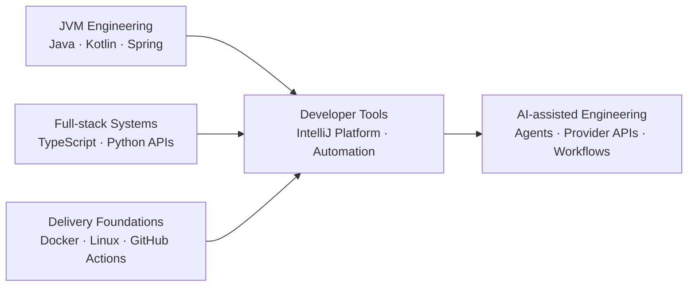

  

  

  
  
  
  

## About me

- Full-stack technology explorer working across Java, Kotlin, Python, TypeScript, Go, and Rust ecosystems.
- Building developer tools that remove friction from reading code, translating context, and operating AI-assisted workflows.
- Author of an IntelliJ IDEA immersive translation plugin with provider-first architecture and non-destructive inline rendering.
- Exploring agent harnesses, coding agents, and API compatibility through focused forks and reproducible local experiments.
- Based in Guangdong, China.

## Engineering path

## Featured project

### IDEA Immersive Translate

  

  
  
  

A Kotlin-based IntelliJ IDEA plugin that translates Java and Kotlin comments, Markdown prose, and plain text into inline editor inlays. It supports OpenAI-compatible APIs, Gemini, Microsoft Translator, and Google Cloud Translation while keeping source files unchanged.

<strong>What is inside</strong>

- Provider-specific configuration and credentials
- Progressive translation with cancellation and error handling
- Segment caching by provider, target language, and source context
- Support for comments, Javadoc, KDoc, Markdown, and plain text
- Gradle-based plugin packaging and sandbox IDE execution

## AI systems laboratory

The repositories below are clearly identified as forks. I use them to study architecture, test integrations, and maintain targeted customizations; credit remains with their upstream authors.

<table>
<tr>
<td width="50%" valign="top">

<strong>Agent harness study</strong> Python, TypeScript, Shell, and JavaScript experiments based on <a href="https://github.com/mindfold-ai/Trellis">mindfold-ai/Trellis</a>.

</td>
<td width="50%" valign="top">

<strong>API compatibility study</strong> FastAPI gateway exploration based on <a href="https://github.com/chenyme/grok2api">chenyme/grok2api</a>.

</td>
</tr>
<tr>
<td width="50%" valign="top">

<strong>Coding-agent customization</strong> TypeScript and Rust exploration based on <a href="https://github.com/anomalyco/opencode">anomalyco/opencode</a>.

</td>
<td width="50%" valign="top">

<strong>Python coding-agent study</strong> Educational feature-port exploration based on <a href="https://github.com/ultraworkers/claw-code">ultraworkers/claw-code</a>.

</td>
</tr>
</table>

## Technology radar

  

## Contribution signal

  <picture>
    <source media="(prefers-color-scheme: dark)" srcset="https://raw.githubusercontent.com/GongHang1/GongHang1/output/github-contribution-grid-snake-dark.svg" />
    
  </picture>

  <em>Build tools that make complex systems easier to understand, operate, and improve.</em>

  

